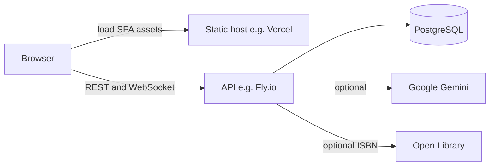

# Architecture

This document describes how the **Valsoft Library** mini library management system is structured and why key choices were made. For day-to-day API details and conventions, see [AGENTS.md](AGENTS.md).

## Overview

The product is **staff-only**: librarians and admins sign in with email and password. There is no public patron portal. The stack is a **React SPA** talking to a **FastAPI** backend over **REST** (and one **WebSocket** for AI progress), with **PostgreSQL** as the system of record.

## Backend

- **Framework**: FastAPI, async-compatible lifespan, centralized exception handling ([`middlewares/exception_handler.py`](middlewares/exception_handler.py)).
- **Persistence**: SQLModel (SQLAlchemy) + Alembic migrations; PostgreSQL in production.
- **Layout**: Vertical **feature slices** under [`features/`](features/): `routes.py` (HTTP/WS), `controllers.py` (HTTP mapping), `services.py` (domain and DB), `schemas.py` (Pydantic contracts).
- **Routers** (registered in [`core/create_app.py`](core/create_app.py)):
  - `/auth` — register, login, logout, session (`session_id` cookie).
  - `/library` — books (CRUD, checkout, checkin, AI enrich), loans list, clients (patrons).
  - `/admin` — admin-only: all open loans, employee CRUD.
  - Health and optional metrics (see config).

CORS is configured for **browser credentials** (`allow_credentials=True`) with origins from `ALLOWED_ORIGINS` (comma-separated). This matters when the SPA and API are on different hosts.

## Frontend

The UI lives in the sibling repository **valsoft-library-frontend**. At a high level:

- **React 19** + **Vite**, **TypeScript** (strict), **React Router** for navigation.
- **TanStack Query** for server state; **Axios** with `withCredentials: true` so `session_id` is sent on API calls.
- **Zustand** mirrors auth for layouts and menus; **Zod** validates forms against API shapes.
- **Feature folders** under `src/features/` (auth, library, admin, shared UI).

See [valsoft-library-frontend/AGENTS.md](../valsoft-library-frontend/AGENTS.md) for paths and UI conventions.

## Authentication and authorization

- **Mechanism**: Opaque server-side sessions; the browser stores a **`session_id`** HTTP-only cookie set by the API on login.
- **Roles**: `admin` and `employee`. Registration creates employees; the first admin is seeded via Alembic when `SEED_ADMIN_EMAIL` / `SEED_ADMIN_PASSWORD` are set during `alembic upgrade` (see [AGENTS.md](AGENTS.md)).
- **No corporate SSO**: The assignment listed SSO as a bonus “preferably.” This app targets a **small, internal staff** surface. Email/password plus roles keeps the challenge focused on catalog and circulation while still demonstrating **permissioned** access (library vs admin routes).

## Circulation and catalog data

- **Books** may be **soft-deleted** (`deleted_at`); active ISBN uniqueness ignores deleted rows.
- **Loans** live in the `loan` table: **checked out** means `returned_at` is null; **checkin** sets `returned_at`. The staff user who performed checkout is stored on the loan.
- **Clients** (patrons) are normalized contacts; checkout can **upsert** by email, while the dedicated create-patron endpoint enforces unique emails.

## AI-assisted catalog enrichment (optional)

- **Endpoints**: `POST /library/books/ai/enrich` and WebSocket `/library/books/ai/enrich/stream` for progress updates from the UI.
- **Behavior**: The model returns **suggestions** only; the UI applies them explicitly. The backend combines **deterministic duplicate detection** against the database with Gemini output so staff can confirm before saving ([`features/books/ai_services.py`](features/books/ai_services.py)).
- **Resilience**: HTTP client supports timeouts, retries with backoff, and optional serialization of concurrent Gemini calls to reduce rate-limit bursts ([`features/books/gemini_client.py`](features/books/gemini_client.py)).
- **ISBN**: Optional lookup via Open Library before or alongside AI enrichment.

Requires `GEMINI_API_KEY` and `GEMINI_MODEL` in the environment.

## Split deployment (e.g. Vercel + Fly.io)

Typical layout: **static assets** on one origin (SPA) and **API** on another.

1. **CORS**: The API must list the **exact** SPA origin(s) in `ALLOWED_ORIGINS` (not `*`) when using cookies.
2. **Cookies**: For cross-site XHR/fetch with credentials, session cookies need **`Secure`** and usually **`SameSite=None`**, and the frontend must call the API with **full base URL** and credentials enabled.
3. **WebSockets**: The SPA’s WebSocket base URL must target the API host (e.g. `wss://…`) when not using the dev proxy.

Local development often uses an **empty** `VITE_API_BASE_URL` and Vite’s **proxy** so browser and API appear same-origin; production sets `VITE_API_BASE_URL` (and WS variant if used) to the public API URL.

## Design decisions (summary)

| Topic | Choice | Rationale |
|--------|--------|------------|
| API style | REST + JSON | Simple contract, easy to test and document; matches assignment openness. |
| Database | PostgreSQL | Fits relational catalog, loans, and constraints; Alembic for repeatable schema. |
| Structure | Feature folders | Keeps routes, rules, and schemas co-located as the app grows. |
| Book removal | Soft delete | Preserves history and avoids breaking past loans; ISBN can be reused for a new copy. |
| AI output | Suggestions + DB-grounded duplicates | Reduces bad merges and aligns with real staff workflows (confirm before save). |
| Auth | Session cookie, not SSO | Appropriate for internal staff scope; roles still satisfy “permissions” bonus intent. |
